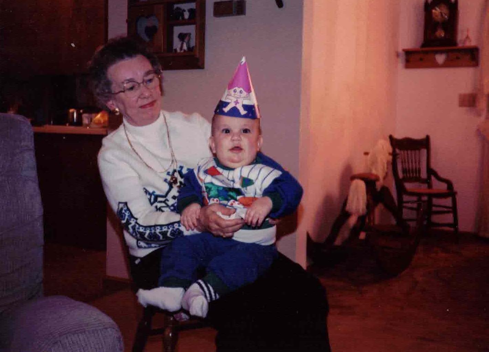
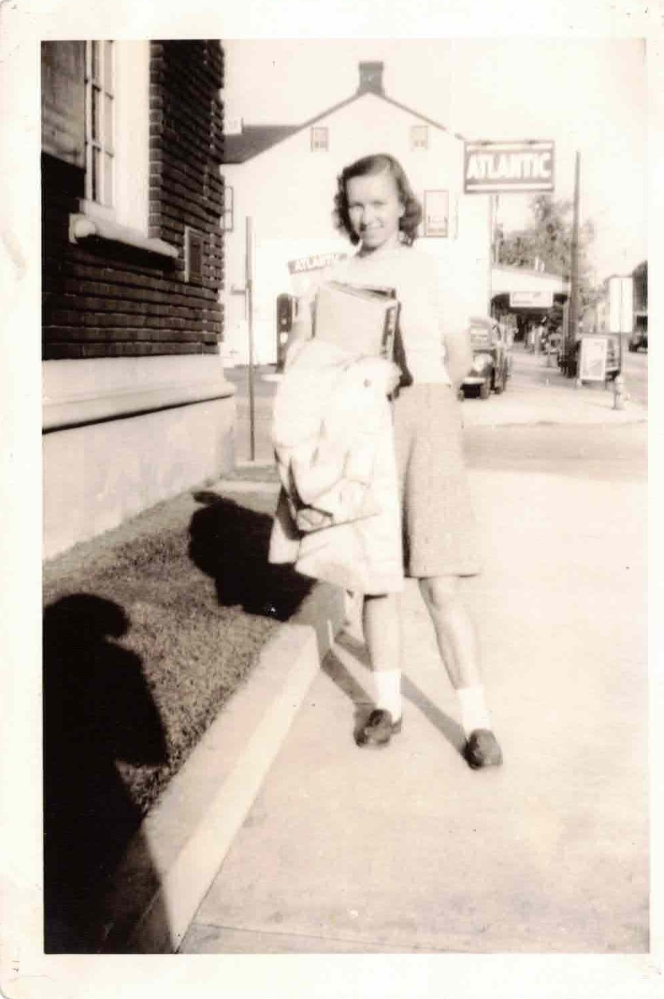

My grandmother, June, was one of the hardest-working and most thoughtful people I have ever encountered. She put a lot of love and effort into everything she made, and it always seemed that her recipes tasted the best. Through her pear jelly recipe, her love and kindness have lived on. It has been a staple in the family for years serving as the final variable for the perfect dinner roll at Thanksgiving, Christmas, and Easter dinners. Or perhaps just late-night peanut butter and pear jelly sandwiches that I became fond of while in college.

We hope you use this recipe to bring happiness to your family, as it has brought so much to ours.
--Ben

# June's beloved pear jelly recipe

#### Ingredients

4 cups of prepared pears (about 3 pounds of ripe fruit)

¼ cup water

¼ cup lemon juice

7 ½ cups (3 ¼ pounds) sugar

1 teaspoon cinnamon

1 teaspoon cloves

1 teaspoon allspice

1 box Sure Jell pectin, 1.75 oz.

#### Prep and Cooking instructions

Peel, core and chop very fine, 3 pounds of ripe pears. Add chopped pears, water and lemon juice into saucepan. Cook until fruit is soft. Use a food mill or potato masher to mash the cooked fruit. Place 4 cups of the prepared fruit & juice mixture into a large saucepan. Add the Sure Jell pectin and bring to a full rolling boil. Add the exact amount of sugar and the cinnamon, cloves and allspice into the saucepan and mix well. Bring the mixture back to a full rolling boil, stirring constantly. Boil hard for 1 minute, stirring constantly to minimize foaming. Ladle preserves into jars and seal.

Yields approximately 8-9, 8 ounce jars of preserves.

